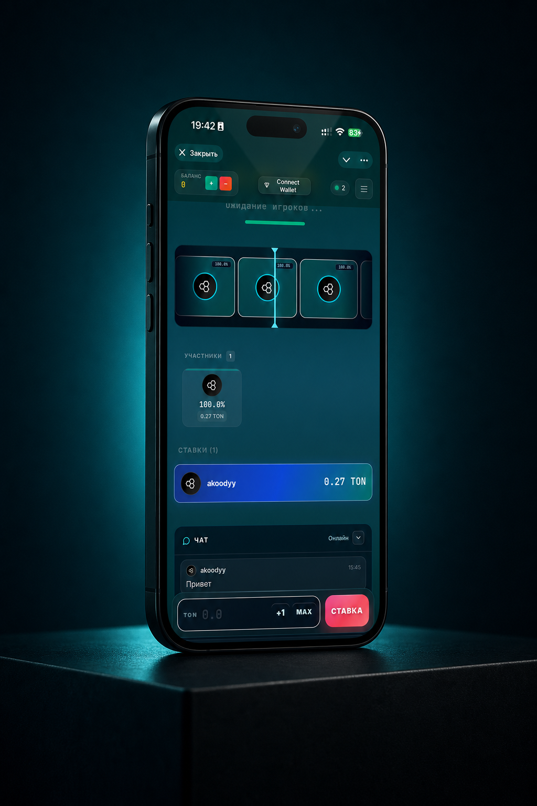

# TONanza

TONanza is a Telegram Mini App for a TON-based jackpot casino experience. Players enter fast PvP jackpot rounds, place TON-denominated bets, watch the live pot grow, and see the winner selected through a provably-fair round flow.

The project is built as a full-stack TypeScript product: a mobile-first Telegram WebApp client, a Node.js backend, PostgreSQL persistence, Socket.IO realtime updates, TON wallet/deposit infrastructure, game history, referrals, and in-game chat.



## Stack

- Node.js 20, TypeScript, Fastify
- PostgreSQL and Prisma ORM
- Socket.IO for live game state and chat updates
- Telegram Mini Apps / Telegram WebApp SDK
- TON wallet, deposit watcher, and payout service modules
- React 18, Vite, Tailwind/PostCSS
- Docker and Docker Compose for deployment

## Product Scope

- Jackpot PvP game loop with active rounds and winner history
- TON-denominated betting UI with compact mobile controls
- Provably-fair seed utilities for transparent winner selection
- Real-time pot, players, roulette, chat, and round-state updates
- TON payment/deposit UX for Telegram Mini App users
- Referral and onboarding flows
- Admin/moderation foundations for chat and operational control
- Production-oriented repository setup: Docker, env examples, docs, and build checks

## Repository Layout

```text
.
├── src/
│   ├── game/             # Jackpot round and provably-fair game domain
│   ├── wallet/           # TON deposit, entropy, and payout services
│   ├── chat/             # In-game chat schemas, moderation, persistence
│   ├── bot/              # Telegram bot integration
│   └── server.ts         # Fastify application entrypoint
├── frontend/             # Telegram Mini App casino client
├── prisma/               # Prisma schema and migrations
├── Dockerfile            # Production backend image
├── docker-compose.yml    # PostgreSQL + backend runtime
└── deploy.sh             # Optional SSH deploy helper
```
